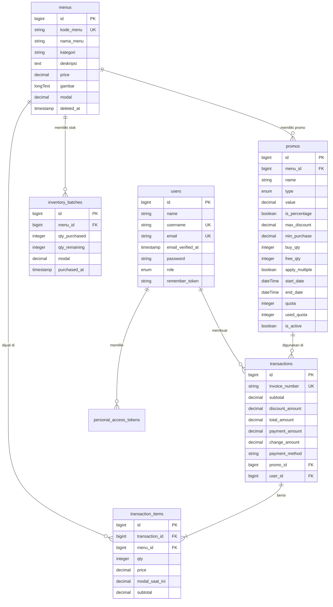

# Database Relational Schema

Dokumentasi skema database untuk POS FNB Backend.
Terdiri dari **6 tabel utama** aplikasi beserta relasi dan constraint-nya, ditambah tabel utility bawaan Laravel.

---

## Entity Relationship Diagram (ERD)

---

## 1. `users`

**Relations**:
- `hasMany` → `transactions`
- `hasMany` → `personal_access_tokens` (Sanctum)

| Column              | Type                    | Attributes       |
| ------------------- | ----------------------- | ---------------- |
| `id`                | bigint                  | Primary Key      |
| `name`              | string                  |                  |
| `username`          | string                  | Unique, Nullable |
| `email`             | string                  | Unique           |
| `email_verified_at` | timestamp               | Nullable         |
| `password`          | string                  | Hashed           |
| `role`              | enum('admin', 'kasir')  | Default: 'kasir' |
| `remember_token`    | string                  | Nullable         |
| `created_at`        | timestamp               |                  |
| `updated_at`        | timestamp               |                  |

---

## 2. `menus`

**Relations**:
- `hasMany` → `inventory_batches`
- `hasMany` → `transaction_items`
- `hasMany` → `promos`

**Computed Attributes** (tidak ada di database, dihitung dari relasi):
- `total_stock` = SUM(`inventory_batches.qty_remaining`)
- `is_active` = `total_stock > 0`

| Column              | Type                    | Attributes       |
| ------------------- | ----------------------- | ---------------- |
| `id`                | bigint                  | Primary Key      |
| `kode_menu`         | string                  | **Unique**       |
| `nama_menu`         | string                  |                  |
| `kategori`          | string                  |                  |
| `deskripsi`         | text                    | Nullable         |
| `price`             | decimal(15,2)           | Default: 0       |
| `gambar`            | longText                | Nullable         |
| `modal`             | decimal(15,2)           | Default: 0       |
| `deleted_at`        | timestamp               | Soft Delete      |
| `created_at`        | timestamp               |                  |
| `updated_at`        | timestamp               |                  |

> **Catatan:** Kolom `is_active` telah dihapus dari database karena redundan.
> Status aktif menu sekarang dihitung otomatis dari total stok inventory (`total_stock > 0`).

---

## 3. `promos`

**Relations**:
- `belongsTo` → `menus` (menu_id) — Nullable, promo bisa berlaku untuk semua menu
- `hasMany` → `transactions`

| Column              | Type                    | Attributes                |
| ------------------- | ----------------------- | ------------------------- |
| `id`                | bigint                  | Primary Key               |
| `menu_id`           | bigint                  | FK → `menus.id`, Nullable |
| `name`              | string                  |                           |
| `type`              | enum('discount','bogo') |                           |
| `value`             | decimal(15,2)           | Nullable                  |
| `is_percentage`     | boolean                 | Default: false            |
| `max_discount`      | decimal(15,2)           | Nullable                  |
| `min_purchase`      | decimal(15,2)           | Nullable                  |
| `buy_qty`           | integer                 | Nullable                  |
| `free_qty`          | integer                 | Nullable                  |
| `apply_multiple`    | boolean                 | Default: false            |
| `start_date`        | dateTime                |                           |
| `end_date`          | dateTime                |                           |
| `quota`             | integer                 | Nullable (system-managed) |
| `used_quota`        | integer                 | Default: 0 (system-managed) |
| `is_active`         | boolean                 | Default: true             |
| `created_at`        | timestamp               |                           |
| `updated_at`        | timestamp               |                           |

> **Penting:** Field `quota` dan `used_quota` dikelola otomatis oleh sistem saat checkout.
> Tidak boleh diubah manual melalui API update promo.

---

## 4. `transactions`

**Relations**:
- `belongsTo` → `promos` (promo_id)
- `belongsTo` → `users` (user_id)
- `hasMany` → `transaction_items`

| Column              | Type                    | Attributes                     |
| ------------------- | ----------------------- | ------------------------------ |
| `id`                | bigint                  | Primary Key                    |
| `invoice_number`    | string                  | Unique, Auto-generated         |
| `subtotal`          | decimal(15,2)           |                                |
| `discount_amount`   | decimal(15,2)           | Default: 0                     |
| `total_amount`      | decimal(15,2)           |                                |
| `payment_amount`    | decimal(15,2)           |                                |
| `change_amount`     | decimal(15,2)           |                                |
| `payment_method`    | string                  | Default: 'Cash'                |
| `promo_id`          | bigint                  | FK → `promos.id`, Nullable     |
| `user_id`           | bigint                  | FK → `users.id`, Nullable      |
| `created_at`        | timestamp               |                                |
| `updated_at`        | timestamp               |                                |

---

## 5. `transaction_items`

**Relations**:
- `belongsTo` → `transactions` (transaction_id)
- `belongsTo` → `menus` (menu_id) — menggunakan `withTrashed()` untuk riwayat

| Column              | Type                    | Attributes                     |
| ------------------- | ----------------------- | ------------------------------ |
| `id`                | bigint                  | Primary Key                    |
| `transaction_id`    | bigint                  | FK → `transactions.id`        |
| `menu_id`           | bigint                  | FK → `menus.id`                |
| `qty`               | integer                 |                                |
| `price`             | decimal(15,2)           | Harga saat transaksi           |
| `modal_saat_ini`    | decimal(15,2)           | Total COGS via FIFO            |
| `subtotal`          | decimal(15,2)           | price × qty                    |
| `created_at`        | timestamp               |                                |
| `updated_at`        | timestamp               |                                |

---

## 6. `inventory_batches`

**Relations**:
- `belongsTo` → `menus` (menu_id)

| Column              | Type                    | Attributes                     |
| ------------------- | ----------------------- | ------------------------------ |
| `id`                | bigint                  | Primary Key                    |
| `menu_id`           | bigint                  | FK → `menus.id`                |
| `qty_purchased`     | integer                 | Jumlah awal dibeli             |
| `qty_remaining`     | integer                 | Sisa stok batch                |
| `modal`             | decimal(15,2)           | Harga modal per unit           |
| `purchased_at`      | timestamp               | Waktu pembelian stok           |
| `created_at`        | timestamp               |                                |
| `updated_at`        | timestamp               |                                |

---

## Foreign Key Behavior (ON DELETE)

| FK Column                          | Parent Table   | ON DELETE  | Alasan                                            |
| ---------------------------------- | -------------- | ---------- | ------------------------------------------------- |
| `transactions.promo_id`            | `promos`       | SET NULL   | Riwayat transaksi tetap ada walau promo dihapus    |
| `transactions.user_id`             | `users`        | SET NULL   | Riwayat transaksi tetap ada walau kasir dihapus    |
| `transaction_items.transaction_id` | `transactions` | CASCADE    | Item ikut terhapus jika transaksi dihapus          |
| `transaction_items.menu_id`        | `menus`        | RESTRICT   | Tidak boleh hapus menu yang punya riwayat transaksi|
| `inventory_batches.menu_id`        | `menus`        | CASCADE    | Batch ikut terhapus jika menu dihapus              |
| `promos.menu_id`                   | `menus`        | CASCADE    | Promo ikut terhapus jika menu target dihapus       |

---

## System / Default Tables

| Tabel                              | Deskripsi                        |
| ---------------------------------- | -------------------------------- |
| `personal_access_tokens`           | API tokens via Laravel Sanctum   |
| `password_reset_tokens`            | Token reset password             |
| `sessions`                         | Penyimpanan session              |
| `cache`, `cache_locks`             | Application cache                |
| `jobs`, `job_batches`, `failed_jobs` | Job queue sistem               |
